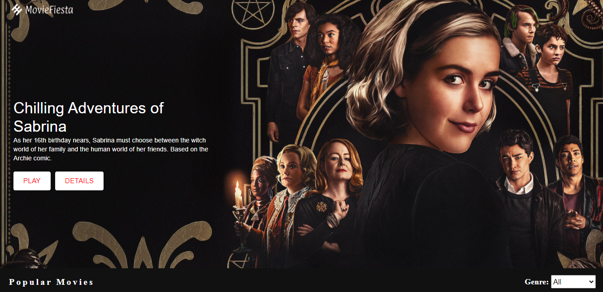
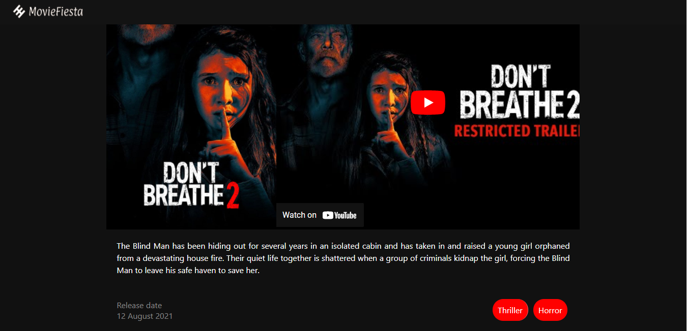

### Catalogue of Dog Clothes
# MOVIE-FIESTA
This application obtains data from TMDB via the TMDB API. Movie-fiesta is a web application that displays Movies and TV series based on different categories. Each category can be filtered based on genre.

[Demo Link](https://movie-fiesta.herokuapp.com/)

### Production Dependencies

| **Dependency**   | **Use**                                              |
| ---------------- | ---------------------------------------------------- |
| prop-types       | Declare types for props passed into React components |
| react            | React library                                        |
| react-dom        | React library for DOM rendering                      |
| react-redux      | Connects React components to Redux                   |
| react-router-dom | React library for routing                            |
| redux            | Library for unidirectional data flows                |
| redux-thunk      | Async redux library middleware                               |
| axios            | Make HTTP calls                                      |
| react-youtube    | To embed youtue player in our appliation             |
| movie-trailer    | To obtain the youtube video ID of a video            |

 
 

### Development Dependencies

| **Dependency**                  | **Use**                                                          |
| ------------------------------- | ---------------------------------------------------------------- |
| babel-eslint                    | Lint modern JavaScript via ESLint                                |
| eslint                          | Lints JavaScript                                                 |
| eslint-plugin-react-hooks       | Adds additional React-hooks-related rules to ESLint              |
| eslint-plugin-import            | Advanced linting of ES6 imports                                  |
| eslint-plugin-react             | Adds additional React-related rules to ESLint                    |
| jest                            | Automated testing framework                                      |
| enzyme                          | Test components, and write assertions                            |
| enzyme-adapter-react-16         | React adapter for enzyme                                         |
| stylelint                       | Lints Css                                                        |
| stylelint-config-standard       | Advanced linting configuration for css                           |
| stylelint-csstree-validator     | Advanced linting validation for css                              |
| stylelint-scss                  | Adds additional SCSS-related rules to StyleLint                  |

## Prerequisites
- TMDB API KEY
- Internet
- Computer

### Install and Setup
- Clone repo to your local `https://github.com/GraceOyiza/movie-fiesta`
- cd into the cloned repo
- Obtain [TMDB](https://www.themoviedb.org/) API KEY
- Create a .env file in the root of the repository
- Add all necessary environment variables to .env file (Check .env.sample file for required variables)
- Open a terminal in the root of the app
- Run `npm install` to install dependencies
- Run Start up your server with `npm run start`
- Open http://localhost:3000/ in your browser.

### Testing
- Open a terminal and run `npm run test`.

## Author

👤 **Popoola Grace Boluwatife**

- Github: [@GraceOyiza](https://github.com/GraceOyiza)
- Twitter: [@\_PopsonGrace](https://twitter.com/_PopsonGrace)
- LinkedIn: [@grace](https://www.linkedin.com/in/grace-popoola)

## 🤝 Contributing

Contributions, issues and feature requests are welcome!

Feel free to check the [issues page](https://github.com/GraceOyiza/movie-fiesta/issues).

## Show your support

Give a ⭐️ if you like this project!

## Acknowledgments

- TMDB

## 📝 License